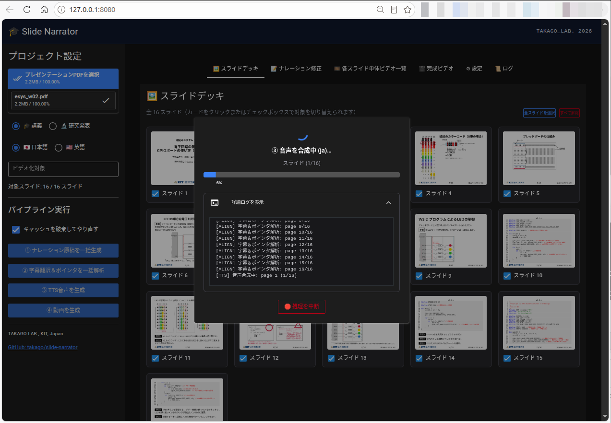
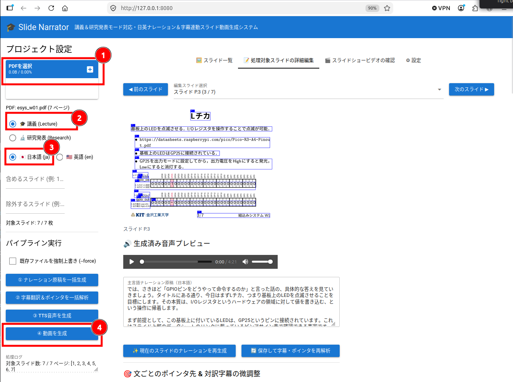

# slide-narrator
Turn your PDF presentation slides into narrated lecture videos with AI.

講義や研究発表用のPDF形式スライドから音声付きスライドショー動画（日本語・英語字幕対応）を自動的に生成するシステムです。
 - CLI版とWebUI版(niceguiを利用）
 - 日本語スライド → 日本語音声＋和英字幕
 - 英語スライド → 英語音声＋和英字幕
 - レーザポインタ風マーカーでどこを話しているかをポイントしますので，ある程度は視聴者の視線を誘導できます．プログラムコードやベクター系の図であれば部分的にポイントはできます（期待は厳禁）．
 - AIが生成したナレーションが気に入らない場合は，直接手で編集できます．
 - 日本語TTSが正しくナレーションできるように，ユーザ辞書とLLMを使って一部のテキストをカタカナ表記にフィルタリングしています．
 - 全ての処理をローカル環境で済ませることが可能です（OpenAI互換APIをもったLLM/TTSサーバをローカルで稼働させてください）．以下は私が使っている環境です．
   - (1) LLMサーバ: ollama ( https://ollama.com/ )
     - LLMは"Qwen3.8-27b ( https://huggingface.co/Qwen/Qwen3.8-27B )
   - (2) 英語TTSサーバ: remskyさんの https://github.com/remsky/Kokoro-FastAPI 
   - (3) 日本語TTSサーバ: Aratakoさんの https://github.com/Aratako/Irodori-TTS-Server
     - 参照音声としてはhadouさんの　https://huggingface.co/datasets/hadou1225/Hadou-Voice-Dataset
       


## セットアップ(Linuxの場合)
```bash
sudo apt install ffmpeg git
git clone --depth 1 https://github.com/takago/slide-narrator.git
cd slide-narrator

curl -LsSf https://astral.sh/uv/install.sh | sh
uv venv -p 3.10 .venv
source .venv/bin/activate
uv pip install -r requirements.txt

（必要に応じて）.
vi config.yaml        # OpenAI互換エンドポイントを持ったLLM，TTSサーバを指定してください．
vi tts_filter.yaml    # OpenAI互換エンドポイントを持ったLLMを指定してください．
```
LLMとTTSの設定はWebUIからでもできます．

## 起動(WebUI)
```bash
python3 app.py 
```
ブラウザで接続後，(1)PDFをアップロード，(2)発表種別の選択，(3)主言語(日本語or英語)の選択を行った後，「④動画の生成」ボタンを押すだけです．

（開発中の画面です）

## 起動(CLI)
（省略）

## ライセンス (License)
本プロジェクトは GNU General Public License v3.0 (GPLv3) の下で公開します。
詳細は LICENSE ファイルをご確認ください。
