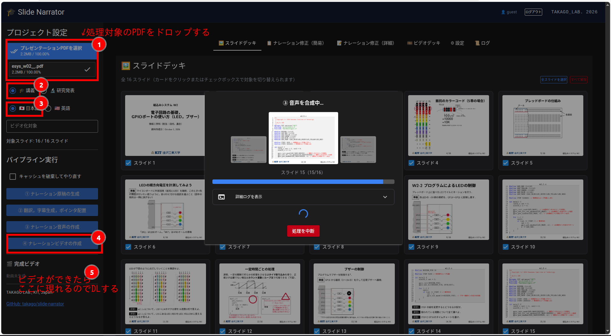

# slide-narrator
Turn your PDF presentation slides into narrated lecture videos with AI.

> **Note:** I chose the name `slide-narrator` when I created this repository, and only later discovered that several unrelated projects and packages use the same name. This project is independent of those projects.
>
> **注意:** 本リポジトリ作成後に，同じ `slide-narrator` という名前を使用している無関係のプロジェクトやパッケージがいくつか存在することに気付きました．本プロジェクトはそれらとは独立したものです．

講義や研究発表用のPDF形式スライドから音声付きスライドショー動画（日本語・英語字幕対応）を自動的に生成するシステムです．オンデマンド教材の作成などに使えると思います．
 - CLI版とWebUI版(niceguiを利用）
 - ナレーション音声は，日本語スライドか英語スライドには関係なく，日本語と音声の好きな方を付与できます．
 - 字幕は日本語と英語の両方が最終ビデオに埋め込まれます（字幕対応プレーヤであればOFF/JP/ENを切り替えることができます）．
 - レーザポインタ風マーカーでどこを話しているかをポイントしますので，ある程度は視聴者の視線を誘導できます．プログラムコードや図でもある程度ポイントできます．
 - AIが生成したナレーションが気に入らない場合は，直接手で編集できます．
 - 日本語TTSが正しくナレーションできるように，ユーザ辞書とLLMを使って一部のテキストをカタカナ表記にフィルタリングしています．
 - 全ての処理をローカル環境で済ませることが可能です（OpenAI互換APIをもったLLM/TTSサーバをローカルで稼働させてください）．
   - 参考まで以下は私が使っている環境です．
     - (1) LLMサーバ: ollama ( https://ollama.com/ )
       - LLMは"Qwen3.8-27b ( https://huggingface.co/Qwen/Qwen3.8-27B )
       - Nvidia GeForce RTX5090 で稼働
     - (2) 日本語TTSサーバ: Aratakoさんの https://github.com/Aratako/Irodori-TTS-Server
       - 参照音声としてはhadouさんの　https://huggingface.co/datasets/hadou1225/Hadou-Voice-Dataset
       - Nvidia GeForce RTX5070Ti で稼働
     - (3) 英語TTSサーバ: remskyさんの https://github.com/remsky/Kokoro-FastAPI
       - これは負荷が軽いのでCPUで稼働
   - 実行は遅いかもしれませんが，DGX Spark が1台あれば十分動かせると思います． 
       


## セットアップ(Linuxの場合)
```bash
sudo apt install ffmpeg git
git clone --depth 1 https://github.com/takago/slide-narrator.git
cd slide-narrator

curl -LsSf https://astral.sh/uv/install.sh | sh
uv venv -p 3.10 .venv
source .venv/bin/activate
uv pip install -r requirements.txt

（必要に応じて）.
vi +61 app.py         # ログイン画面で入力するIDとパスワードを変更してください
vi config.yaml        # OpenAI互換エンドポイントを持ったLLM，TTSサーバを指定してください．
vi tts_filter.yaml    # OpenAI互換エンドポイントを持ったLLMを指定してください．
```
LLMとTTSの設定はWebUIからでもできます．

## 起動(WebUI)
```bash
python3 app.py 
```
ブラウザで http://localhost:17171 に接続後し，IDをパスワードを入力してログインします．あとは，(1)PDFをアップロード，(2)発表種別の選択，(3)主言語(日本語or英語)の選択を行った後，「④動画の生成」ボタンを押すだけです．

## 起動(CLI)
（省略）

## ライセンス (License)
本プロジェクトは GNU General Public License v3.0 (GPLv3) の下で公開します。
詳細は LICENSE ファイルをご確認ください。
